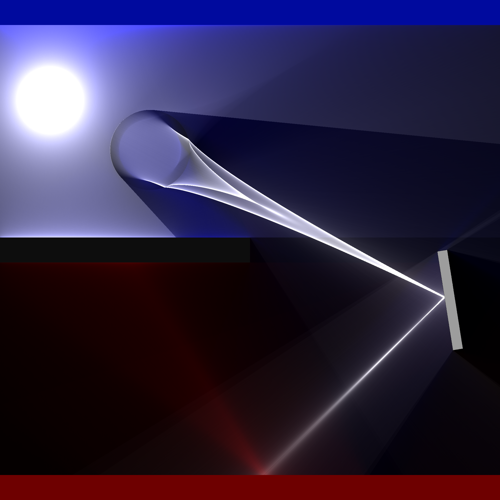

# Lightrace

## What is this?

Lightrace is a 2D raytracer that models light passing through the scene rather than creating an image of the surfaces of objects as in traditional ray tracing. This allows interesting phenomena like caustics to be seen in the medium rather than just their projections on surfaces.

Lightrace combines two methods: computing direct lighting from light sources and splatting lines randomly sampled from lights as they bounce through the scene.

Supports:

* Circles and arbitrary polygon shapes
* Cone, point, edge, and shape lights
* A material model with transmission, roughness, and color parameters

## How to use?

There is currently no user interface for rendering. Set up a scene programmatically and save the result; an example is shown in the repository.

## Possible improvements

* Spectral rendering
* On light bounces, instead of splatting a single line of light, compute a visibility cone of the scene from the collision point and draw the resulting shape
* Use the GPU more effectively
* Combine other sampling methods, like typical backwards ray tracing methods or photon mapping
* Sort scene objects into an acceleration structure like a BVH
